# Sơ Đồ DFD và BFD - Hệ Thống Quản Lý Kho

## 1. Biểu Đồ Luồng Nghiệp Vụ (BFD - Business Flow Diagram)

### Sơ Đồ Tổng Quan Nghiệp Vụ
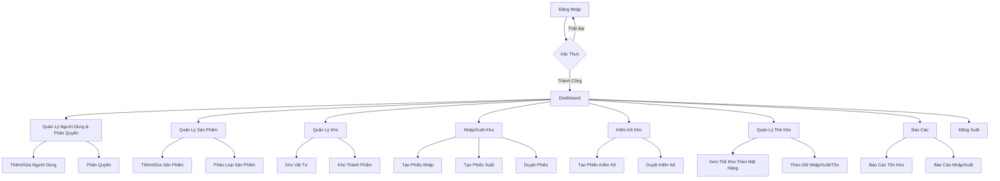

### Luồng Nghiệp Vụ - Đăng Nhập & Phân Quyền
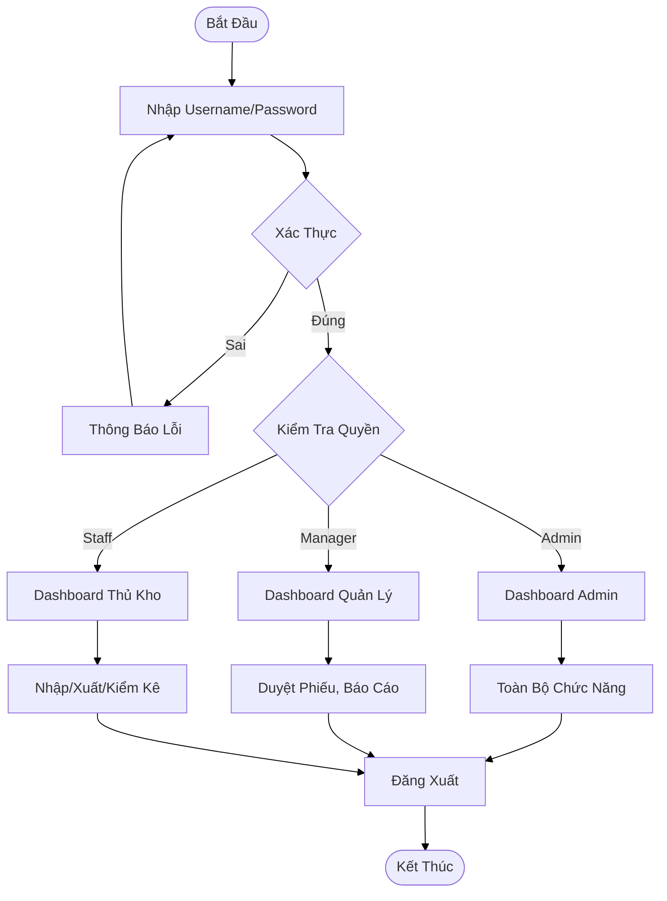

### Luồng Nghiệp Vụ - Nhập/Xuất Kho
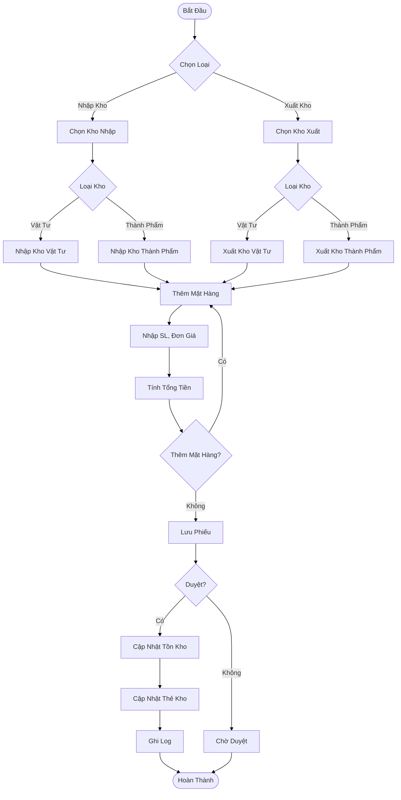

### Luồng Nghiệp Vụ - Kiểm Kê Kho
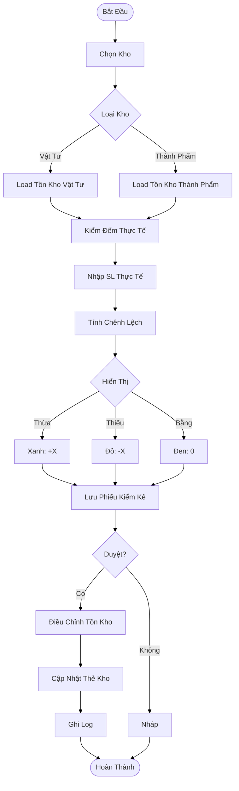

### Luồng Nghiệp Vụ - Quản Lý Thẻ Kho
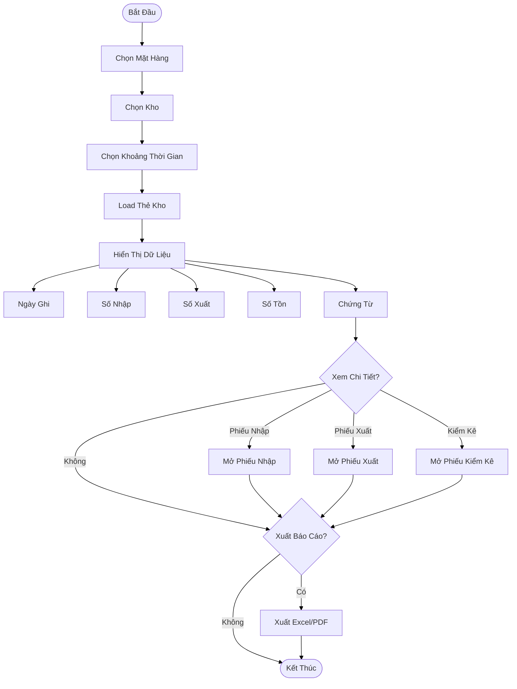

## 2. Sơ Đồ Luồng Dữ Liệu (DFD - Data Flow Diagram)

### Ký Hiệu Chuẩn DFD

#### Tác nhân ngoài (External Entities)
- **E1**: Phòng cung ứng
- **E2**: Phòng kinh doanh
- **E3**: Ban giám đốc

#### Tiến trình (Processes)
- **P1**: Tiếp nhận & xử lý phiếu nhập kho
- **P2**: Tiếp nhận & xử lý phiếu xuất kho
- **P3**: Cập nhật tồn kho & thẻ kho
- **P4**: Kiểm kê kho
- **P5**: Lập báo cáo kho

#### Kho dữ liệu (Data Stores)
- **D1**: Danh mục hàng hóa
- **D2**: Danh mục kho
- **D3**: Phiếu nhập kho
- **D4**: Phiếu xuất kho
- **D5**: Thẻ kho
- **D6**: Dữ liệu kiểm kê
- **D7**: Báo cáo kho

### DFD Mức 0 - Sơ Đồ Ngữ Cảnh
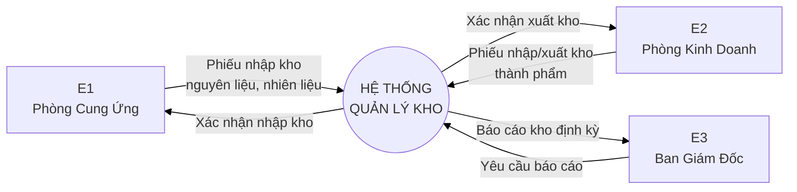

### DFD Mức 1 - Chi Tiết Các Chức Năng
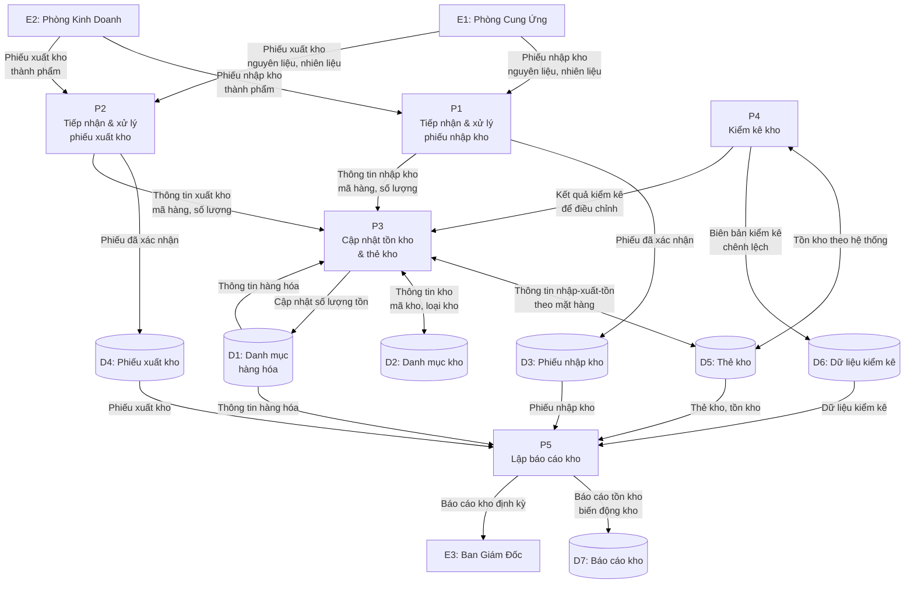

### Mô Tả Chi Tiết Dòng Dữ Liệu

#### 2.1. Luồng NHẬP KHO
| Từ | Đến | Dữ liệu |
|---|---|---|
| E1 | P1 | Phiếu nhập kho (nguyên liệu, nhiên liệu, phụ tùng) |
| E2 | P1 | Phiếu nhập kho thành phẩm |
| P1 | D3 | Phiếu nhập kho đã được kiểm tra và xác nhận |
| P1 | P3 | Thông tin nhập kho (mã hàng, số lượng, kho nhập) |
| P3 | D5 | Cập nhật thẻ kho (nhập) |
| P3 | D1 | Cập nhật số lượng tồn hàng hóa |

#### 2.2. Luồng XUẤT KHO
| Từ | Đến | Dữ liệu |
|---|---|---|
| E1 | P2 | Phiếu xuất kho (nguyên liệu, nhiên liệu, phụ tùng) |
| E2 | P2 | Phiếu xuất kho thành phẩm |
| P2 | D4 | Phiếu xuất kho đã được xác nhận |
| P2 | P3 | Thông tin xuất kho (mã hàng, số lượng, kho xuất) |
| P3 | D5 | Cập nhật thẻ kho (xuất) |
| P3 | D1 | Giảm số lượng tồn hàng hóa |

#### 2.3. Luồng TỒN KHO & THẺ KHO
| Từ | Đến | Dữ liệu |
|---|---|---|
| P3 | D5 | Thông tin nhập – xuất – tồn theo từng mặt hàng |
| D5 | P3 | Dữ liệu thẻ kho hiện tại |
| P3 | D2 | Thông tin kho (mã kho, loại kho) |
| D2 | P3 | Danh mục kho |

#### 2.4. Luồng KIỂM KÊ KHO
| Từ | Đến | Dữ liệu |
|---|---|---|
| D5 | P4 | Tồn kho theo hệ thống |
| P4 | D6 | Biên bản kiểm kê, chênh lệch |
| P4 | P3 | Kết quả kiểm kê để điều chỉnh tồn kho (nếu có) |

#### 2.5. Luồng BÁO CÁO KHO
| Từ | Đến | Dữ liệu |
|---|---|---|
| D1 | P5 | Thông tin hàng hóa |
| D3 | P5 | Phiếu nhập kho |
| D4 | P5 | Phiếu xuất kho |
| D5 | P5 | Thẻ kho / tồn kho |
| D6 | P5 | Dữ liệu kiểm kê |
| P5 | D7 | Báo cáo tồn kho, báo cáo biến động kho |
| P5 | E3 | Báo cáo kho định kỳ |
```

### DFD Mức 2 - Chi Tiết Kiểm Kê Kho (Process P4)
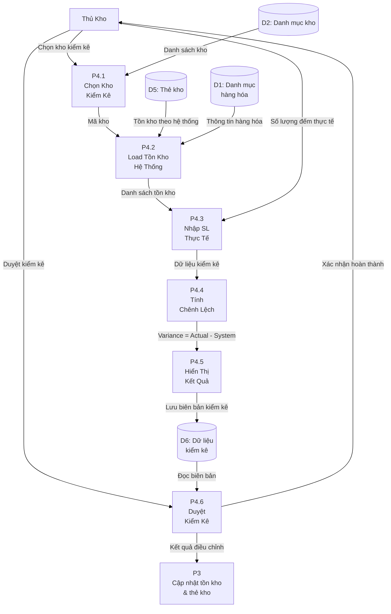


## 3. Sơ Đồ ERD - Mối Quan Hệ Dữ Liệu
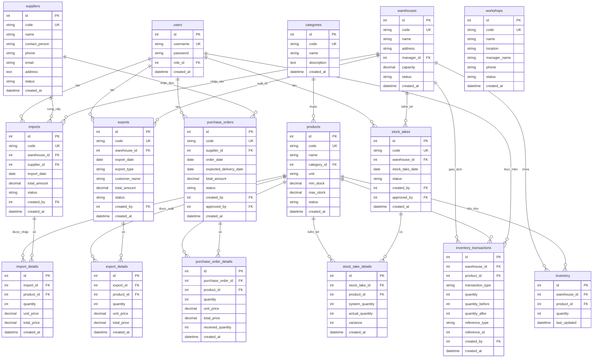

## 4. Sơ Đồ Kiến Trúc Hệ Thống

### 4.1. Kiến Trúc MVC Tổng Quan
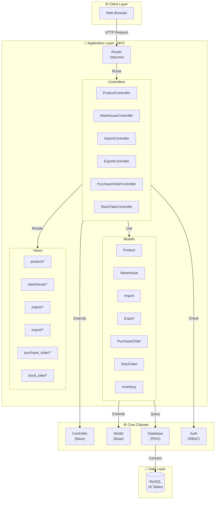

### 4.2. RBAC - Phân Quyền
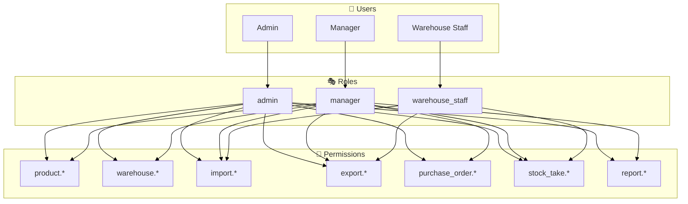

## 5. Mô Tả Các Quy Trình Chính

### 5.1. Quy Trình Nhập Kho
1. **Input**: Kho nhập (vật tư/thành phẩm), nhà cung cấp, sản phẩm, số lượng, đơn giá
2. **Process**:
   - Thủ kho tạo phiếu nhập với nhiều mặt hàng
   - Validate kho và nhà cung cấp
   - Tính tổng tiền
   - Lưu imports (phiếu nhập - chứng từ pháp lý) và import_details
   - **Khi duyệt**: 
     - Cập nhật inventory (tăng số lượng)
     - Cập nhật warehouse_cards (ghi nhập theo ngày)
     - Ghi log vào inventory_transactions
3. **Output**: Phiếu nhập được duyệt, tồn kho tăng, thẻ kho được cập nhật
4. **Data Store**: imports, import_details, inventory, warehouse_cards, inventory_transactions

### 5.2. Quy Trình Xuất Kho
1. **Input**: Kho xuất (vật tư/thành phẩm), khách hàng/phân xưởng, sản phẩm, số lượng
2. **Process**:
   - Thủ kho tạo phiếu xuất với nhiều mặt hàng
   - Validate kho và tồn kho đủ
   - Tính tổng tiền
   - Lưu exports (phiếu xuất - chứng từ pháp lý) và export_details
   - **Khi duyệt**: 
     - Cập nhật inventory (giảm số lượng)
     - Cập nhật warehouse_cards (ghi xuất theo ngày)
     - Ghi log vào inventory_transactions
3. **Output**: Phiếu xuất được duyệt, tồn kho giảm, thẻ kho được cập nhật
4. **Data Store**: exports, export_details, inventory, warehouse_cards, inventory_transactions

### 5.3. Quy Trình Kiểm Kê
1. **Input**: Kho kiểm kê (vật tư/thành phẩm), số lượng thực tế
2. **Process**:
   - Thủ kho chọn kho và load tồn kho hệ thống từ inventory
   - Kiểm đếm và nhập số lượng thực tế
   - Tính variance = actual - system
   - Hiển thị màu: xanh (+), đỏ (-), đen (0)
   - Lưu stock_takes và stock_take_details
   - **Khi duyệt**: 
     - Điều chỉnh inventory theo actual
     - Cập nhật warehouse_cards (ghi điều chỉnh)
     - Ghi log điều chỉnh vào inventory_transactions
3. **Output**: Tồn kho được điều chỉnh, thẻ kho được cập nhật
4. **Data Store**: stock_takes, stock_take_details, inventory, warehouse_cards, inventory_transactions

### 5.4. Quản Lý Thẻ Kho

#### Mục đích
Thẻ kho là công cụ nội bộ để thủ kho theo dõi chi tiết tình hình nhập – xuất – tồn của từng mặt hàng tại từng kho.

#### Thông tin trên Thẻ Kho

**A. Thông tin mặt hàng**:
- Tên vật tư/hàng hóa
- Mã hàng
- Đơn vị tính
- Mẫu mã (nếu có)

**B. Thông tin quản lý**:
- Đơn giá (giá nhập gần nhất hoặc giá bình quân)
- Mức dự trữ tối thiểu
- Mức dự trữ tối đa
- Kho lưu trữ

**C. Thông tin giao dịch** (theo từng dòng):
- Ngày phát sinh nghiệp vụ
- Số chứng từ (mã phiếu nhập/xuất/kiểm kê)
- Loại chứng từ (Phiếu nhập/Phiếu xuất/Biên bản kiểm kê)
- Số lượng nhập
- Số lượng xuất
- Số lượng tồn (sau giao dịch)
- Ghi chú (nếu có)

#### Quy trình

1. **Input**: Mặt hàng, kho, khoảng thời gian
2. **Process**:
   - Thủ kho chọn mặt hàng và kho cần xem
   - Hệ thống tổng hợp từ các phiếu nhập/xuất/kiểm kê đã duyệt
   - Hiển thị theo thứ tự thời gian:
     - Ngày ghi
     - Số chứng từ (có link đến phiếu gốc)
     - Số nhập
     - Số xuất
     - Số tồn (tính tự động)
   - Cho phép xem chi tiết phiếu nhập/xuất/kiểm kê từ thẻ kho
   - Xuất báo cáo thẻ kho (Excel/PDF)
   - Cảnh báo khi tồn kho < mức tối thiểu hoặc > mức tối đa
3. **Output**: Báo cáo thẻ kho theo mặt hàng
4. **Data Store**: warehouse_cards (inventory_transactions), imports, exports, stock_takes

#### Ví dụ Thẻ Kho

```
THẺ KHO
─────────────────────────────────────────────────────
Tên hàng: Thép tròn D10          Mã hàng: VT001
Đơn vị tính: Kg                  Đơn giá: 15,000 đ/kg
Mức tồn tối thiểu: 500 kg        Mức tồn tối đa: 2,000 kg
Kho: Kho vật tư A
─────────────────────────────────────────────────────
Ngày    | Chứng từ  | Loại    | Nhập  | Xuất  | Tồn
─────────────────────────────────────────────────────
01/01   | Tồn đầu   | -       | -     | -     | 800
05/01   | PN001     | Nhập    | 500   | -     | 1,300
10/01   | PX001     | Xuất    | -     | 300   | 1,000
15/01   | PN002     | Nhập    | 700   | -     | 1,700
20/01   | PX002     | Xuất    | -     | 400   | 1,300
25/01   | KK001     | Kiểm kê | -     | 50    | 1,250 (Điều chỉnh: -50)
─────────────────────────────────────────────────────
```

---

**Ghi chú**: 
- **Phiếu nhập/xuất**: Chứng từ mang tính pháp lý, mỗi phiếu có thể gồm nhiều mặt hàng
- **Thẻ kho**: Công cụ nội bộ để thủ kho theo dõi nhập–xuất–tồn theo từng mặt hàng, được tổng hợp từ phiếu nhập/xuất và ghi theo từng ngày
- **Kho vật tư**: Phục vụ cung ứng/sản xuất
- **Kho thành phẩm**: Phục vụ kinh doanh/bán hàng
- Tất cả sơ đồ được vẽ bằng Mermaid và có thể render trong VS Code hoặc GitHub.
