# ERD - Hệ Thống Quản Lý Kho (Database Schema)

## Sơ Đồ ERD Hoàn Chỉnh

```mermaid
erDiagram
    %% Authentication & Authorization Tables
    users ||--o{ role_permissions : "has"
    users ||--o{ imports : "creates"
    users ||--o{ exports : "creates"
    users ||--o{ purchase_orders : "creates"
    users ||--o{ stock_takes : "creates"
    users ||--o{ inventory_transactions : "performs"
    users ||--o| warehouses : "manages"
    
    roles ||--o{ users : "assigned_to"
    roles ||--o{ role_permissions : "has"
    permissions ||--o{ role_permissions : "granted_in"
    
    %% Master Data Tables
    categories ||--o{ products : "contains"
    
    suppliers ||--o{ imports : "supplies_to"
    suppliers ||--o{ purchase_orders : "receives_from"
    
    agencies }o--|| users : "managed_by"
    
    warehouses ||--o{ imports : "receives"
    warehouses ||--o{ exports : "ships_from"
    warehouses ||--o{ inventory : "stores"
    warehouses ||--o{ stock_takes : "audited_in"
    warehouses ||--o{ inventory_transactions : "occurs_in"
    
    %% Transaction Tables - Purchase Orders
    purchase_orders ||--o{ purchase_order_details : "contains"
    purchase_order_details }o--|| products : "orders"
    
    %% Transaction Tables - Imports
    imports ||--o{ import_details : "contains"
    import_details }o--|| products : "imports"
    
    %% Transaction Tables - Exports
    exports ||--o{ export_details : "contains"
    export_details }o--|| products : "exports"
    
    %% Transaction Tables - Stock Takes
    stock_takes ||--o{ stock_take_details : "contains"
    stock_take_details }o--|| products : "counts"
    
    %% Inventory Tables
    products ||--o{ inventory : "stored_as"
    products ||--o{ inventory_transactions : "involved_in"
    
    %% Table Definitions
    users {
        int id PK
        string username UK
        string password
        string email
        string full_name
        int role_id FK
        enum status
        timestamp created_at
    }
    
    roles {
        int id PK
        string name UK
        string display_name
        text description
        timestamp created_at
    }
    
    permissions {
        int id PK
        string name UK
        string display_name
        string module
        text description
        timestamp created_at
    }
    
    role_permissions {
        int id PK
        int role_id FK
        int permission_id FK
        timestamp created_at
    }
    
    categories {
        int id PK
        string code UK
        string name
        text description
        enum status
        timestamp created_at
    }
    
    products {
        int id PK
        string code UK
        string name
        int category_id FK
        string unit
        text description
        string image
        int min_stock
        int max_stock
        enum status
        timestamp created_at
    }
    
    suppliers {
        int id PK
        string code UK
        string name
        string contact_person
        string phone
        string email
        text address
        string tax_code
        enum status
        timestamp created_at
    }
    
    agencies {
        int id PK
        string code UK
        string name
        text address
        string contract_number
        date contract_date
        string representative
        string id_card
        string phone
        string email
        string tax_code
        decimal discount_percent
        enum status
        text notes
        timestamp created_at
    }
    
    warehouses {
        int id PK
        string code UK
        string name
        text address
        int manager_id FK
        decimal capacity
        enum status
        timestamp created_at
    }
    
    workshops {
        int id PK
        string code UK
        string name
        text location
        string manager_name
        string phone
        enum status
        text notes
        timestamp created_at
    }
    
    purchase_orders {
        int id PK
        string code UK
        int supplier_id FK
        date order_date
        date expected_delivery_date
        decimal total_amount
        enum status
        int created_by FK
        int approved_by FK
        datetime approved_at
        text notes
        timestamp created_at
    }
    
    purchase_order_details {
        int id PK
        int purchase_order_id FK
        int product_id FK
        int quantity
        decimal unit_price
        decimal total_price
        int received_quantity
        text notes
        timestamp created_at
    }
    
    imports {
        int id PK
        string code UK
        int warehouse_id FK
        int supplier_id FK
        date import_date
        decimal total_amount
        enum status
        int created_by FK
        timestamp created_at
    }
    
    import_details {
        int id PK
        int import_id FK
        int product_id FK
        int quantity
        decimal unit_price
        decimal total_price
        timestamp created_at
    }
    
    exports {
        int id PK
        string code UK
        int warehouse_id FK
        date export_date
        enum export_type
        string customer_name
        decimal total_amount
        enum status
        int created_by FK
        timestamp created_at
    }
    
    export_details {
        int id PK
        int export_id FK
        int product_id FK
        int quantity
        decimal unit_price
        decimal total_price
        timestamp created_at
    }
    
    stock_takes {
        int id PK
        string code UK
        int warehouse_id FK
        date stock_take_date
        enum status
        int created_by FK
        int approved_by FK
        datetime approved_at
        text notes
        timestamp created_at
    }
    
    stock_take_details {
        int id PK
        int stock_take_id FK
        int product_id FK
        int system_quantity
        int actual_quantity
        int variance
        text notes
        timestamp created_at
    }
    
    inventory {
        int id PK
        int warehouse_id FK
        int product_id FK
        int quantity
        timestamp last_updated
    }
    
    inventory_transactions {
        int id PK
        int warehouse_id FK
        int product_id FK
        enum transaction_type
        enum reference_type
        int reference_id
        int quantity
        int quantity_before
        int quantity_after
        decimal unit_price
        text notes
        int created_by FK
        timestamp created_at
    }
```

## Danh Sách Bảng (20 Tables)

### 1. Authentication & Authorization (4 tables)
- **users** - Người dùng hệ thống
- **roles** - Vai trò (admin, manager, warehouse_staff, accountant, viewer)
- **permissions** - Quyền hạn (56 permissions)
- **role_permissions** - Phân quyền cho vai trò

### 2. Master Data (6 tables)
- **categories** - Danh mục sản phẩm
- **products** - Sản phẩm
- **suppliers** - Nhà cung cấp
- **agencies** - Đại lý
- **warehouses** - Kho hàng
- **workshops** - Phân xưởng sản xuất

### 3. Transaction Tables (8 tables)
- **purchase_orders** - Đơn đặt hàng (header)
- **purchase_order_details** - Chi tiết đơn đặt hàng
- **imports** - Phiếu nhập kho (header)
- **import_details** - Chi tiết phiếu nhập
- **exports** - Phiếu xuất kho (header)
- **export_details** - Chi tiết phiếu xuất
- **stock_takes** - Phiếu kiểm kê (header)
- **stock_take_details** - Chi tiết kiểm kê

### 4. Inventory Tables (2 tables)
- **inventory** - Tồn kho hiện tại
- **inventory_transactions** - Lịch sử giao dịch tồn kho

## Mối Quan Hệ Chính

### One-to-Many Relationships
1. **users** → imports, exports, purchase_orders, stock_takes, inventory_transactions
2. **roles** → users, role_permissions
3. **permissions** → role_permissions
4. **categories** → products
5. **suppliers** → imports, purchase_orders
6. **warehouses** → imports, exports, inventory, stock_takes, inventory_transactions
7. **products** → import_details, export_details, purchase_order_details, stock_take_details, inventory, inventory_transactions
8. **purchase_orders** → purchase_order_details
9. **imports** → import_details
10. **exports** → export_details
11. **stock_takes** → stock_take_details

### Many-to-Many (through junction tables)
- **roles** ↔ **permissions** (through role_permissions)

## Enum Values

### users.status
- active
- inactive

### purchase_orders.status
- draft (Nháp)
- sent (Đã gửi)
- confirmed (Đã duyệt)
- received (Đã nhận)
- cancelled (Đã hủy)

### exports.export_type
- sale (Bán hàng)
- internal (Nội bộ)
- damaged (Hư hỏng)
- other (Khác)

### stock_takes.status
- draft (Nháp)
- in_progress (Đang kiểm kê)
- completed (Hoàn thành)
- cancelled (Đã hủy)

### inventory_transactions.transaction_type
- import (Nhập kho)
- export (Xuất kho)
- adjustment (Điều chỉnh)

## Indexes & Constraints

### Unique Keys (UK)
- users.username
- roles.name
- permissions.name
- categories.code
- products.code
- suppliers.code
- agencies.code
- warehouses.code
- workshops.code
- purchase_orders.code
- imports.code
- exports.code
- stock_takes.code

### Foreign Keys (FK)
- users.role_id → roles.id
- role_permissions.role_id → roles.id
- role_permissions.permission_id → permissions.id
- products.category_id → categories.id
- warehouses.manager_id → users.id
- purchase_orders.supplier_id → suppliers.id
- purchase_orders.created_by → users.id
- purchase_orders.approved_by → users.id
- purchase_order_details.purchase_order_id → purchase_orders.id
- purchase_order_details.product_id → products.id
- imports.warehouse_id → warehouses.id
- imports.supplier_id → suppliers.id
- imports.created_by → users.id
- import_details.import_id → imports.id
- import_details.product_id → products.id
- exports.warehouse_id → warehouses.id
- exports.created_by → users.id
- export_details.export_id → exports.id
- export_details.product_id → products.id
- stock_takes.warehouse_id → warehouses.id
- stock_takes.created_by → users.id
- stock_takes.approved_by → users.id
- stock_take_details.stock_take_id → stock_takes.id
- stock_take_details.product_id → products.id
- inventory.warehouse_id → warehouses.id
- inventory.product_id → products.id
- inventory_transactions.warehouse_id → warehouses.id
- inventory_transactions.product_id → products.id
- inventory_transactions.created_by → users.id

## Business Rules

1. **Inventory Updates**: Chỉ cập nhật khi phiếu nhập/xuất được duyệt
2. **Transaction Logging**: Mọi thay đổi tồn kho đều được ghi log vào inventory_transactions
3. **Stock Take Adjustment**: Khi duyệt phiếu kiểm kê, tồn kho được điều chỉnh theo actual_quantity
4. **Purchase Order Flow**: draft → sent → confirmed → received
5. **Stock Take Flow**: draft → in_progress → completed
6. **RBAC**: Phân quyền dựa trên roles và permissions
7. **Audit Trail**: Tất cả bảng có created_at, một số có created_by để audit
